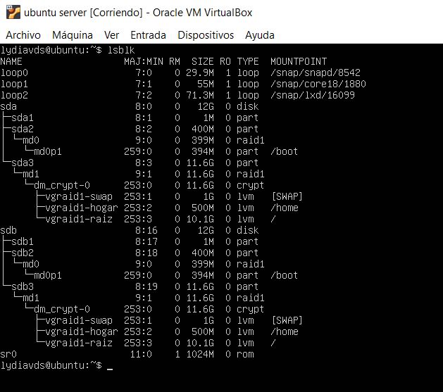
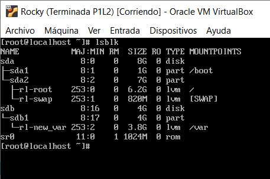
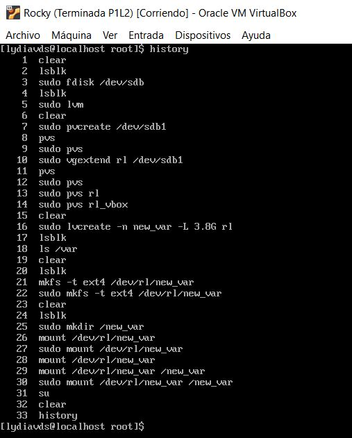
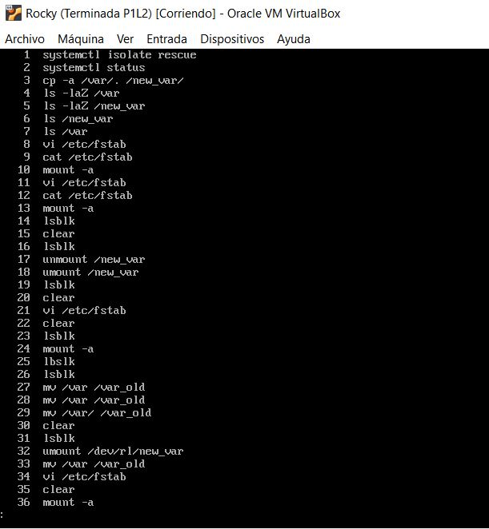
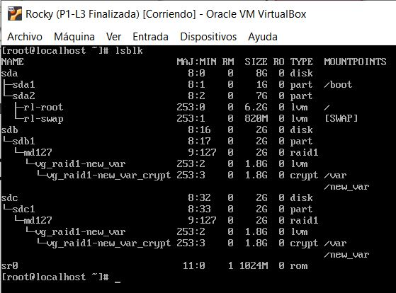
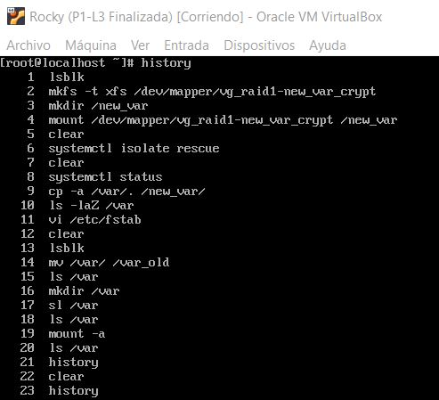

### Lydia van Dillewijn Soto
#### Grupo C1 
#### email: lydiavands@correo.ugr.es
***
# Bitácoras ISE 24-25
## P1-L1 01/10/24:
### lsblk al terminar la sesión

## P1-L2 08/10/24:
### lsblk al terminar la sesión

### history de la parte hecha desde el usuario

### history de la parte hecha en sudo (root)

## P1-L3 15/10/24:
### lsblk al terminar la sesión

### history al terminar la sesión
Al reiniciar la máquina para comporbar el arranque, se han perdido varias instrucciones

## P2_L1 22/10/24:
## Ubuntu

Desde maquina virtual

Desde anfitrion

## Rocky
### history de la sesion

En root maquina virtual

Desde anfitrion
