### Lydia van Dillewijn Soto
#### Grupo C1 
#### email: lydiavands@correo.ugr.es
***
# Bitácoras ISE 24-25
## P1-L1 01/10/24:
### lsblk al terminar la sesión

## P1-L2 08/10/24:
### lsblk al terminar la sesión

### history de la parte hecha desde el usuario

### history de la parte hecha en sudo (root)

## P1-L3 15/10/24:
### lsblk al terminar la sesión

### history al terminar la sesión
Al reiniciar la máquina para comprobar el arranque, se han perdido varias instrucciones

## P2_L1 22/10/24:
### history de la sesión en:
## Ubuntu

Desde máquina virtual

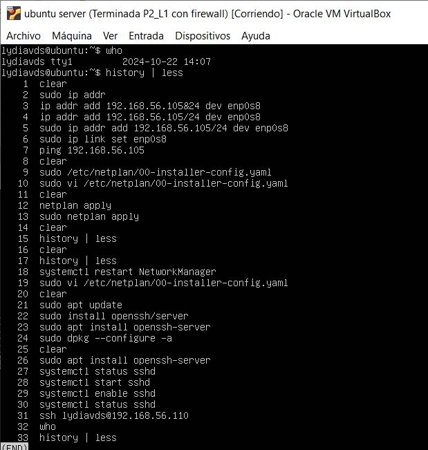

Desde anfitrión

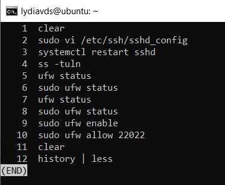

## Rocky

En root máquina virtual

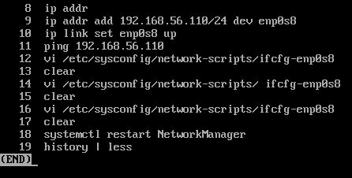

Desde anfitrión

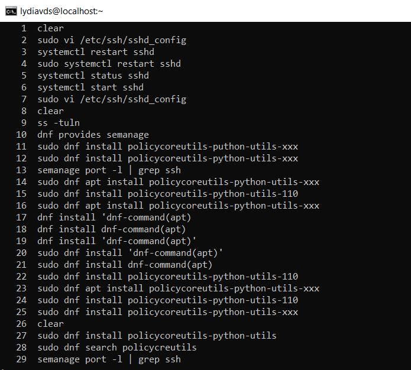
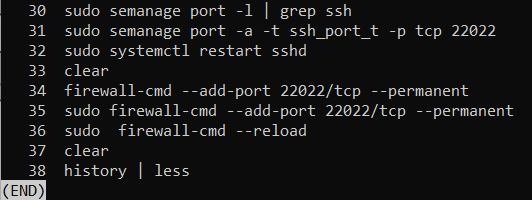 

## P2_L3 29/10/24:
### history de la sesión en:
## Ubuntu

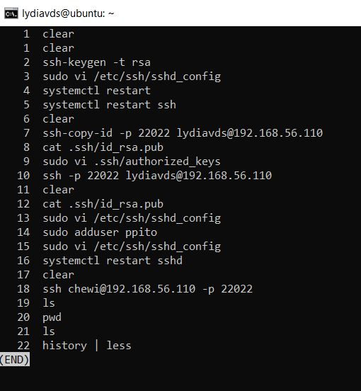 

Prueba con xeyes para probar Xforwarding

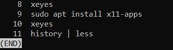 

## Rocky

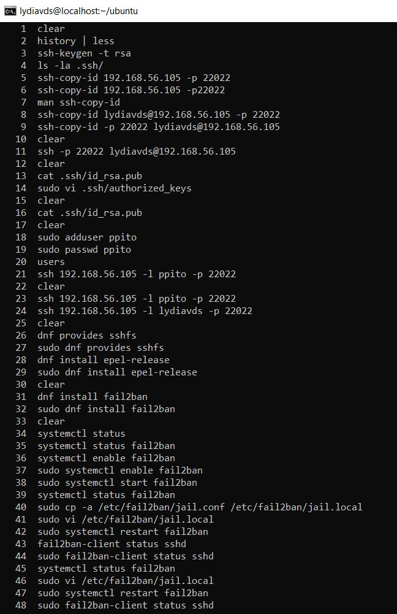 
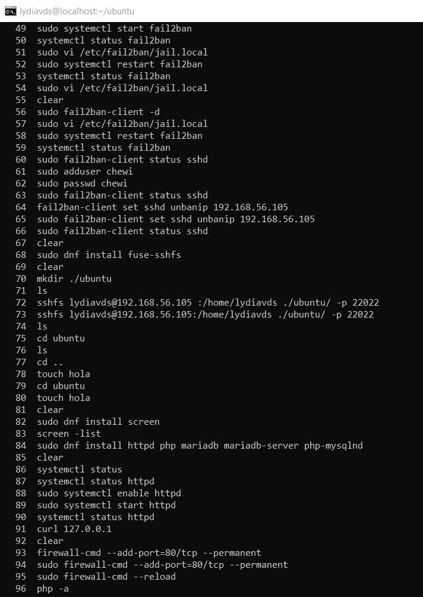
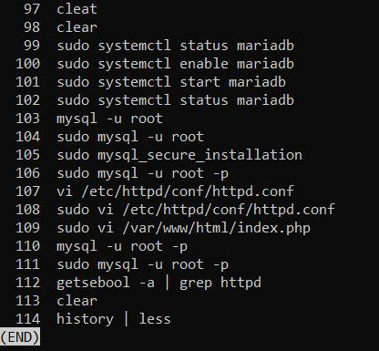

## P2_L2 5/11/24:
### history de los TP1 y TP2 de las prácticas de git en ubuntu
## TP1

## TP2

 
 

## P3 12-19/11/24:
## history de recuperación de disco duro en ubuntu + un poco de ansible

## Zabbix
### history ubuntu (servidor zabbix)

### history rocky (agente rocky)

### Imágenes de monitorización de ubuntu, rocky y sus sshd y httpd

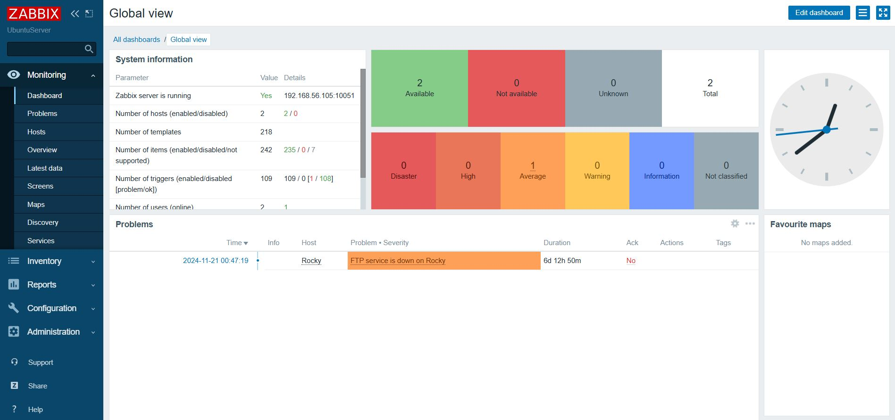

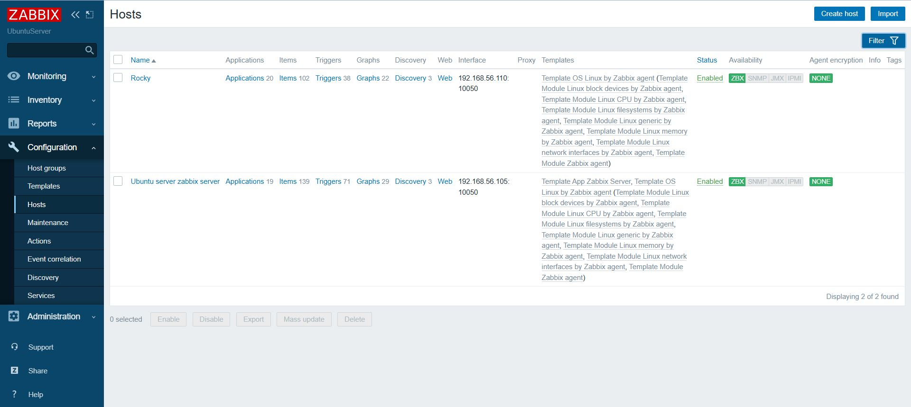

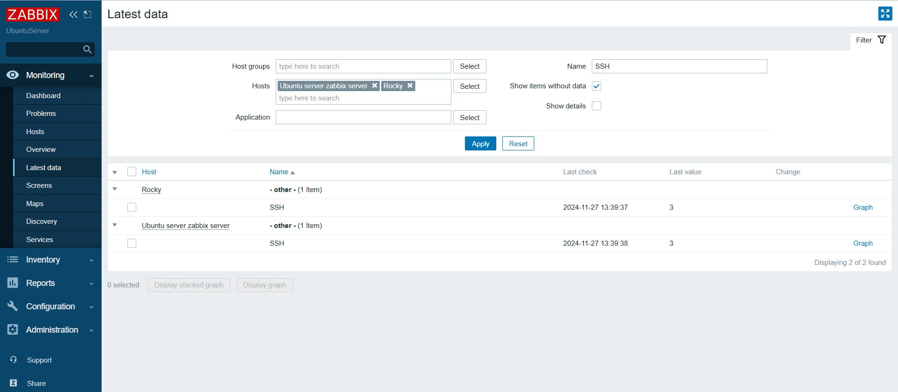

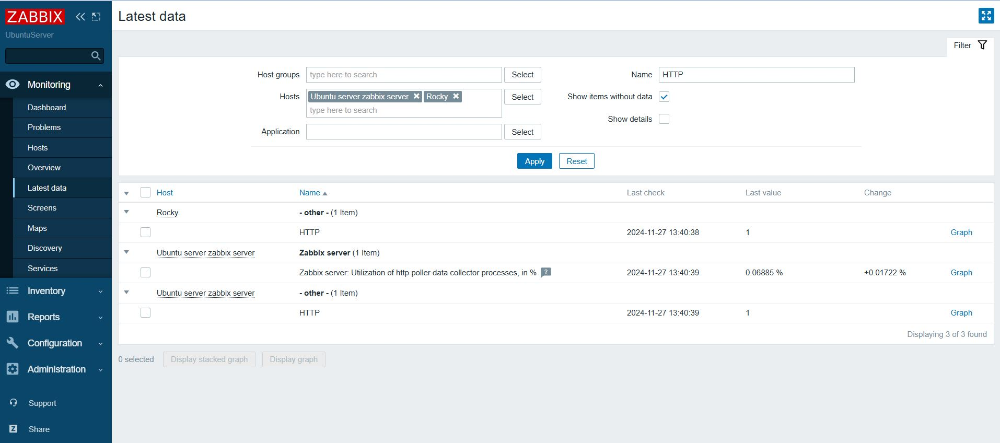

## Ansible
## Ubuntu

### history

### Su playbook 

### La salida del playbook

## Rocky

### history

### Su playbook

### La salida del playbook

## P4 26/11/24-3/12/24:

## Benchmarks con Phoronix en Ubuntu
### Parte del history

### Resultados de los Benchmark

## Docker en Ubuntu

Al hacer docker-compose up no habia suficente espacio:
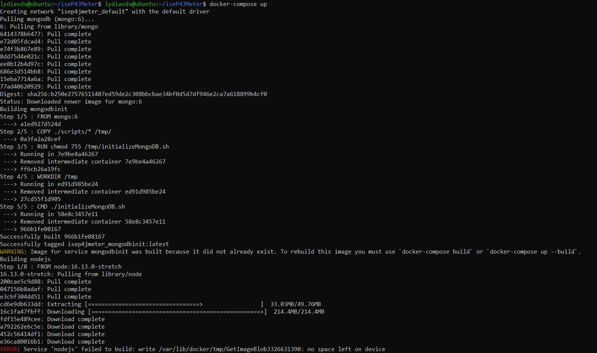
Para que tuviese espacio:

Ahora, al hacer docker-compose up

